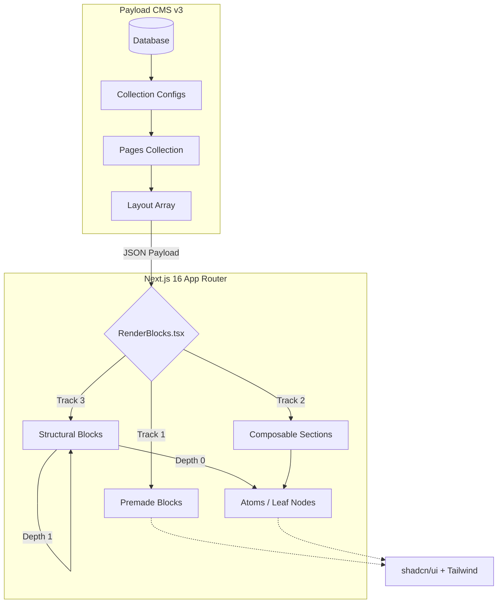

# 🏗️ Next.js + Payload v3 Block Engine Architecture

    

A highly modular, block-based page builder architecture. This system leverages a recursive rendering engine to map deeply nested JSON ASTs from Payload CMS into React components, supporting premade sections, composable layouts, and depth-controlled structural primitives.

---

## 📐 System Architecture



---

## 🧩 The 3-Track Block System

The `layout` array in the `pages` collection accepts three distinct categories of blocks, providing a gradient of control from rigid, high-design components to granular layout primitives.

| Track | Type | Description | Examples |
| :--- | :--- | :--- | :--- |
| **Track 1** | **Premade** | Ready-to-use, fully designed sections with strict schemas. | `HeroGradient`, `BentoGrid`, `FeatureTabs`, `SmartTable`, `Timeline` |
| **Track 2** | **Composable** | Flexible grid/flex layouts allowing editors to populate columns. | `ComposableSection` |
| **Track 3** | **Structural** | Low-level layout primitives supporting recursive nesting. | `Section`, `Container`, `Grid`, `Stack`, `Flex`, `Card`, `Panel` |

### ⚛️ Atoms (Leaf Nodes)
Atoms are the lowest-level UI primitives. They **cannot** contain other blocks. They act as the terminal nodes within Track 2 and Track 3 structures.
*   **Typography/Media:** `TextAtom`, `ImageAtom`, `VideoAtom`, `IconAtom`
*   **Interactive:** `ButtonAtom`, `AccordionAtom`, `StateToggleAtom`
*   **Feedback:** `BadgeAtom`, `AlertAtom`, `ProgressAtom`

---

## ⚙️ Technical Deep Dive: Controlled Nesting

### The Problem: Call Stack Overflows
Payload CMS's import/export plugins and field traversal mechanisms crash (`Maximum call stack size exceeded`) when encountering infinite circular references (e.g., a `Grid` block containing a `content` field that accepts another `Grid` block).

### The Solution: Depth-Based Generation
Instead of recursive self-referencing, structural blocks are generated using a **Depth-Based Strategy** in `src/blocks/Structural/config.ts`. The recursion is "unrolled" to a strict depth limit (e.g., 3 levels).

```typescript
// Conceptual representation of the unrolled AST generation
const generateStructuralBlocks = (depth: number): Block[] => {
  // Base case: Level 0 only accepts Atoms
  const childBlocks = depth > 0 ? generateStructuralBlocks(depth - 1) : []
  const allowedContent = [...childBlocks, ...atomBlocks]

  return structuralTypes.map((slug) => ({
    slug,
    fields: [
      ...getFields(slug),
      {
        name: 'content',
        type: 'blocks',
        blocks: allowedContent, // Strictly typed to the current depth level
      },
    ],
  }))
}

// Generates: Level 2 -> Level 1 -> Level 0 -> Atoms
const generatedBlocks = generateStructuralBlocks(2)
```

---

## 🔄 Rendering Pipeline

The `RenderBlocks` component acts as the central router for the JSON AST. It maps the `blockType` string from the CMS to the corresponding React component.

```tsx
// src/blocks/RenderBlocks.tsx
export const RenderBlocks = ({ blocks }: { blocks: any[] | null | undefined }) => {
  if (!blocks) return null
  return (
    <>
      {blocks.map((block, i) => {
        const Component = blockMap[block.blockType]
        return Component ? <Component key={i} {...block} /> : null
      })}
    </>
  )
}
```

Structural blocks recursively call `RenderBlocks` to render their children, safely terminating at the Atom level due to the CMS schema constraints.

```tsx
// Example of recursive structural rendering
grid: (props: any) => (
  <Grid {...props}>
    <RenderBlocks blocks={props.content} />
  </Grid>
),
```

---

## 🗄️ Data Models (`payload-types.ts`)

The system relies on strictly generated TypeScript interfaces. The core `Page` interface dictates the structure of the routing and layout engine.

```typescript
export interface Page {
  id: string;
  title: string;
  slug: string;
  layout?: (
    | BannerBlock
    | { blockType: 'bentoGrid'; /* ... */ }
    | { blockType: 'featureGrid'; /* ... */ }
    | { blockType: 'heroBanner'; /* ... */ }
    | { blockType: 'smartTable'; /* ... */ }
    | FormBlock
    | RichTextContentBlock
    // ... Track 2 & 3 Blocks
  )[] | null;
  meta?: {
    title?: string | null;
    image?: (string | null) | Media;
    description?: string | null;
  };
  isVariant?: boolean | null; // A/B Testing support
  _status?: ('draft' | 'published') | null;
}
```

---

## 🚀 Getting Started

### 1. Environment Setup
Create a `.env` file in the project root:
```env
DATABASE_URI=mongodb://127.0.0.1/your-db-name
PAYLOAD_SECRET=your-secure-random-string
NEXT_PUBLIC_SERVER_URL=http://localhost:3000
```

### 2. Installation & Execution
```bash
# Install dependencies
npm install

# Generate Payload types based on config
npm run payload generate:types

# Start the Turbopack development server
npm run dev
```

### 3. Project Structure
```text
├── src/
│   ├── blocks/
│   │   ├── Composable/        # Track 2: Grid/Flex layouts & Atoms
│   │   ├── Structural/        # Track 3: Depth-controlled primitives
│   │   ├── RenderBlocks.tsx   # Core recursive rendering engine
│   │   └── ...                # Standard blocks (Banner, Form, etc.)
│   ├── collections/
│   │   ├── Pages/             # Page collection config & layout array
│   │   └── ...                # Media, Users, Forms, Experiments
│   ├── components/
│   │   ├── Designs/           # Track 1: Premade complex sections
│   │   └── ui/                # shadcn/ui components
│   └── payload-types.ts       # Auto-generated strict typings
```
